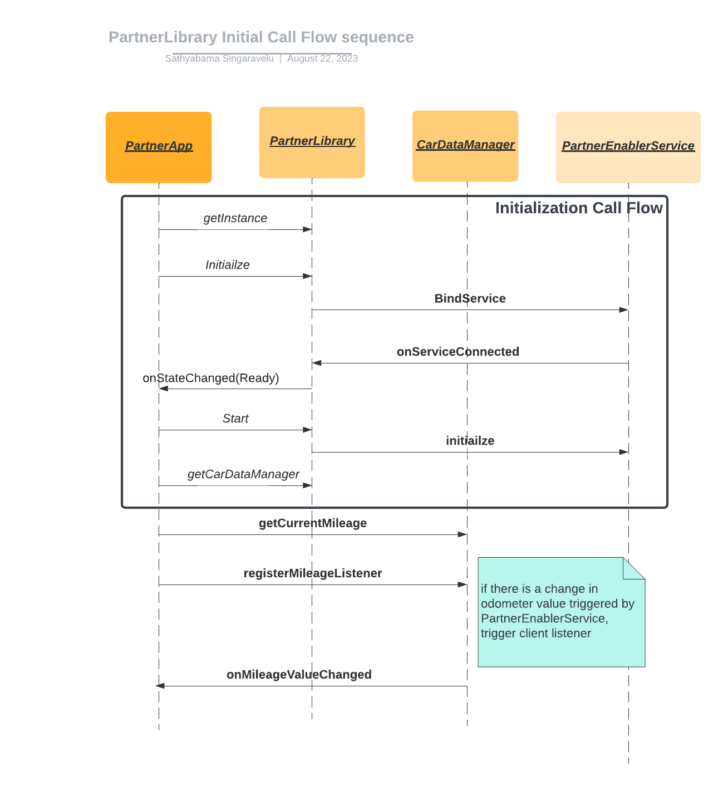

# Getting started


## Introduction

The goal of the Android Automotive Partner API (aka Partner API) is to provide exclusive access for vehicle data and Infotainment functions to app developers.
	
This is a closed API designed for partners who have a commercial relationship with CARIAD and VW Group?
	
During runtime, the Partner API is responsible for,
* Verifying the identity of the Partner 
* Verifying the legitimacy of the permissions being requested by the Partner.
* Granting access to data and system capabilities via API interfaces 

#### When not to use the Partner API?

The Partner API does not replace any standard Android mechanism available to partners to access vehicle data. For e.g., if a partner wants to access "Ignition Status" or "Current position" both of which are available via NORMAL/DANGEROUS protection levels, the partner should not request this via the Partner API. 


## API specification

Currently the Partner API supports the following APIs, 
* [Partner API](www.google.com) (TODO: Hyperlinks to subpage)
* [Vehicle API](www.google.com) (TODO: Hyperlinks to subpage)
* [Current Route API](www.google.com) (TODO: Hyperlinks to subpage)
* Map Rendering API (_Coming soon!_)
* Payment API (Coming soon!)

## Implementation guide

Now that you know what the Partner API offers, let's get you started on using it. This section goes into the details of how to request for specific permissions and use these permissions in your application.

1. Requesting a Partner token:

The Partner token is a MIME64 coded signature string generated using the “SHA256WithRSA” algorithm.
	
You need the following information when requesting a Partner token
* Package name
* List of data-points
* Intended description of usage of data
* Signing certificate of the Partner application
			
Please send the following information to [Sagnik Dhar](mailto:sagnik.dhar@cariad.us) to request your Partner token. In the future this process will be automated via the Partner portal. 

2. Adding the token to your Application's Manifest file:

You will need to add the Partner token generated in the previous step in your AndroidManifest.xml. Along with that, you will also need to add the permissions for the requested APIs. 
	
The specific way to add the Partner token in the AndroidManifest.xml is as below,
    Example tag
    <meta-data android:name="VWAE_Sig_V1" android:value="SM3X..">

#### Sample AndroidManifest.xml file:

**AndroidManifest.xml** 
```
<?xml version="1.0" encoding="utf-8" standalone="no"?>
<manifest xmlns:android=" http://schemas.android.com/apk/res/android" package="com.partner.package.appname">
    <uses-sdk android:minSdkVersion="14" android:targetSdkVersion="15"/>
    
    <uses-permission android:name="android.permission.INTERNET"/>
    <uses-permission android:name="com.volkswagenag.restricted.permission.CAR_MILEAGE"/>
    <uses-permission android:name="com.volkswagenag.permission.restricted.A"/>
    <uses-permission android:name="com.volkswagenag.permission.restricted.D"/>
    <uses-permission android:name="com.volkswagenag.permission.restricted.F"/>
    <uses-permission android:name="com.volkswagenag.permission.restricted.Z"/>
	 
    <application android:icon="@drawable/ic_launcher" android:label="@string/app_name">
    <activity android:label="@string/app_name" android:launchMode="singleTop"
	                  android:name="com.partner.package.appname.MainActivity">
	            <intent-filter>
	                <action android:name="android.intent.action.MAIN"/>
	                <category android:name="android.intent.category.LAUNCHER"/>
	            </intent-filter>
	        </activity>
    <meta-data android:name="VWAE_Sig_V1" android:value="poey44s5ft4GlslH+sMO8LUkXt54SVVNUEI7WxAOOCuHuarafs1rBqPJf/Rhg5lUeLvxFNr+60BH9cea61ifKhLpZnlvgbGPXJziNvlbsIIaNLxugUqwqwGxxYWellVWXu47F7gpT9a215C8V59gWF+/mP8uyGnRAJ0pnkJkW1dswW4w221fIN+/oOXSPaFuEFj5fnhEdHZ0yyAA3oTF+mO5i3QEUp4+2ZY+j+tysRr9nKl6rcQjotwHjCQYp9u1GYsNp6JNBDMc/qP3H3dh3rs6tuOq0f6JQmeA=="/>
</application>
</manifest>
```

3. Download the Partner library and add it to your application

Download Partner Library ver. X.Y (TODO: Add download URL)

4. We also have a sample application which shows how the library can be initialised from your application

Downlaod sample application (TODO: Add download URL)




#### Sample App Initialization code snippet:
**onCreate**
```
        mPartnerLibrary = PartnerLibrary.getInstance(this);
```

**initializePartnerLibrary**
```
    private void initializePartnerLibrary() {
        Log.d(TAG, "initialize");
        mPartnerLibrary.addListener(mLibStateChangeListener);
        mPartnerLibrary.initialize();
    }
```

**ILibStateChangeListener onStateChanged**
```
  class LibStateListener implements ILibStateChangeListener {

        @Override
        public void onStateChanged(boolean ready) throws RemoteException {
            Log.d(TAG,"LibState status: " + ready);
            ...
            if (ready) {
                try {
                    ...
                    mPartnerLibrary.start();
                } catch (Exception e) {
                    mCarDataButton.setVisibility(View.INVISIBLE);
                    mServiceStatusTextView.setText(e.getMessage());
                    e.printStackTrace();
                }
            } else {
                ...
                mPartnerLibrary.stop();
            }
        }
```

**CarDataActivity getCarDataManager**
```
 @Override
    public void onResume() {
        super.onResume();
        mCarDataManager = PartnerLibrary.getInstance(this).getCarDataManager();
        mNavigationManager = PartnerLibrary.getInstance(this).getNavigationManager();
        mCarDataManager.registerMileageListener(CarDataActivity.this);
        mCarDataManager.registerTurnSignalListener(CarDataActivity.this);
        mCarDataManager.registerFogLightStateListener(CarDataActivity.this);
        mCarDataManager.registerSteeringAngleListener(CarDataActivity.this);
    }
```

### To summarize the above steps, here is a checklist of pre-requisites you need to use the Partner API library

* Request Cariad for a Parner token 
* Add Partner token to your application's Android Manifest
* Add necessary permissions to your application's Android Manifest
* Add the Partner API library to your application's Android Manifest


## Testing end-to-end flow

The end-to-end flow is best tested on a Cariad emulator and/or Cariad test-bench. As these are not available to Partners at this point, we have implemented a functionality called 'demo-mode' which allows testing using any Android emulator. 

### Demo mode
Demo mode is a state in the PartnerLibrary that can be enabled using an adb property. When the demo mode is enabled, the PartnerLibrary reads data from json files in the external file directory of the application that it is being included in to simulate mock data over time.

#### Steps to enable demo mode:

1. Push car_data.json and navigation_data.json files to '/sdcard/Android/data/{your-app-package-name}/files/'. Make sure to change {your-package-name} to your applications package name.
```
$ adb root
$ adb push /json-file-location/car_data.json /sdcard/Android/data/{your-app-package-name}/files/
$ adb push /json-file-location/navigation_data.json /sdcard/Android/data/{your-app-package-name}/files/
```

2. Use below commands to set the demo mode property
```
$ adb root
$ adb shell setprop persist.volkswagenag.parterapi.demomode true OR
$ adb shell setprop volkswagenag.parterapi.demomode true
$ adb shell stop
$ adb shell start
```
Note: Feel free to use or not use persist depending on the test requirements. Using persist helps with keeping the demo mode on in between reboots.

3. Start your app to run the PartnerLibrary in Demo mode.


#### File and Schema definitions:
The following are the files and JSON schema for the currently supported APIs:
Note: filenames should exactly be the same.
**1. CarDataManager:**

**Filename:** car_data.json

**Schema:**
```
{
 "change_frequency_secs": Integer,
 "mileage_list": Integer array
 "turn_signal_indicator_list": Array of VehicleSignalIndicator enum ,
 "fog_lights_state_list": Array of VehicleLightState enum,
 "steering_angle_list": Float array,
 "vehicle_identity_number": String
}
```

**Example:**
```
{
 "change_frequency_secs": 10,
 "mileage_list":[5,5,5,10,10,10,20,20,20,40],
 "turn_signal_indicator_list":["PERMISSION_DENIED","NONE","RIGHT","RIGHT","RIGHT","NONE","NONE","NONE","LEFT","LEFT"],
 "fog_lights_state_list":["DAYTIME_RUNNING"],
 "steering_angle_list":[-80,-40,-10,0,0,0,0, 20,50,90],
 "vehicle_identity_number": "1FMZU77E22UC18440"
}
```

**2. NavigationManager:**

**Filename:** navigation_data.json

**Schema:**
```
{
 "change_frequency_secs": Integer,
 "nav_started": Boolean array,
 "active_route": String Array
}
```
Note: The String and booleans in `active_route` and `nav_started` are mapped one on one. i.e, if the value in `nav_started[i]` is false the value in `active_route[i]` is ignored.

**Example:**
```
{
 "change_frequency_secs": 30,
 "nav_started": ["false", "true", "false", "false", "true"],
 "active_route": ["", "kclcF...@sC@YIOKI", "", "", "wblcF~...SZSF_@?"]
}
```

